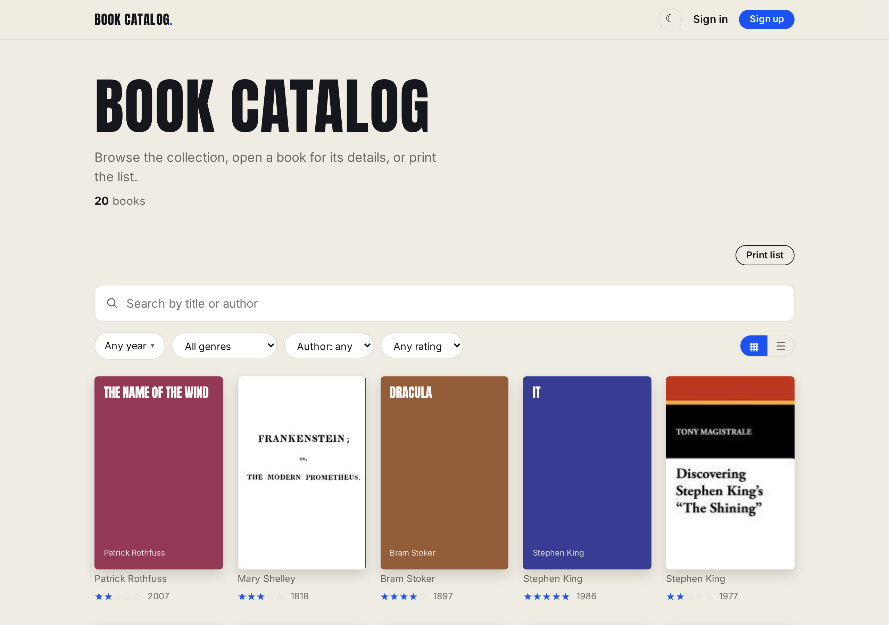
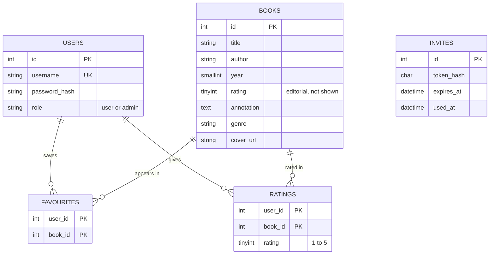
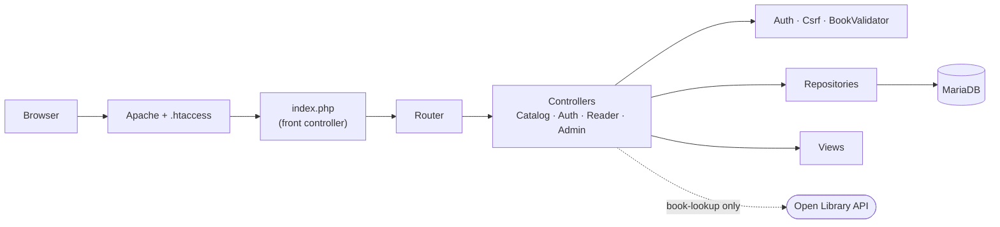
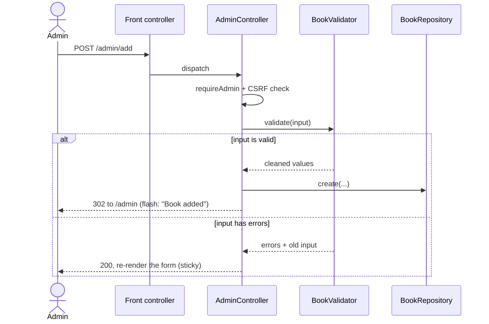
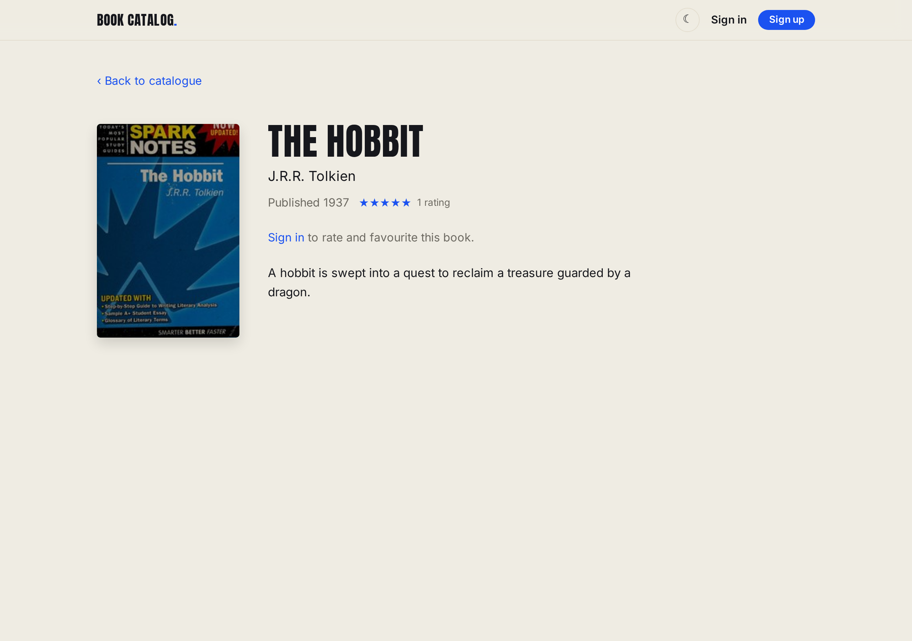
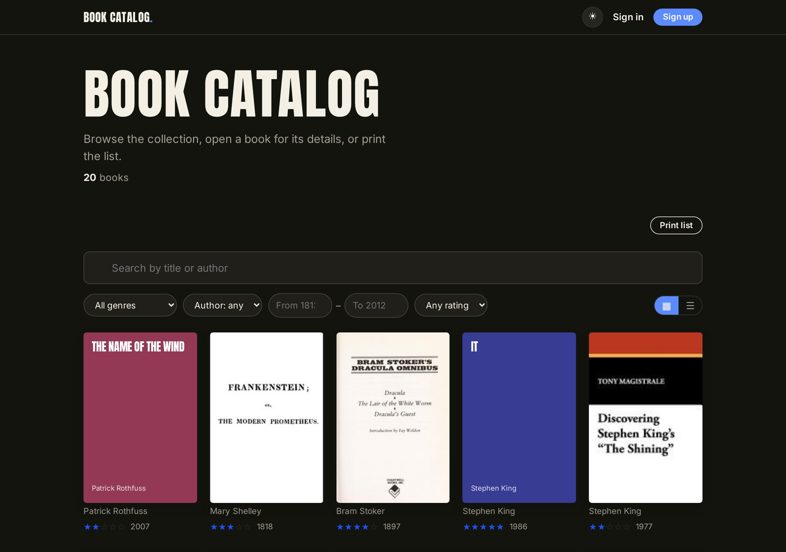
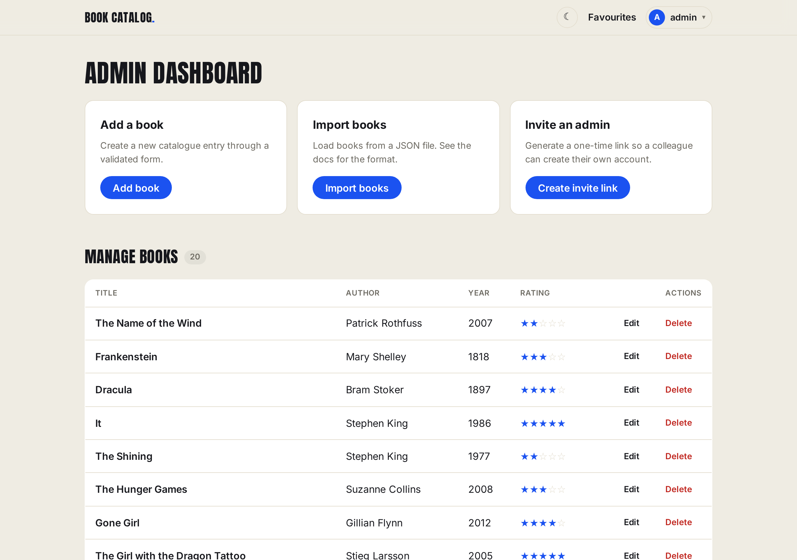

# Architecture and design notes

How the book catalogue is put together and why it is built the way it is. The
[README](../README.md) covers what it does and how to run it; this document is
for someone who will read or extend the code.

## The problem

The brief is a book register with a public side and an admin side. That maps to
three kinds of visitor, and the whole design follows from keeping their needs
apart:

- **A visitor** browses the catalogue, opens a book for its details, and prints
  the list. No account, no friction: this is the common case, so it is the
  fastest path and needs nothing from the server but a page.
- **A reader** (signed in) keeps a shelf of favourites and gives books their own
  1 to 5 rating. These are per-user writes, so they need a login and a CSRF token.
- **An admin** manages the catalogue: add, edit and delete books, import a JSON
  file, and invite another admin. Every action here is guarded and audited by a
  one-time token where it matters.

The assignment is graded on clarity, usability and how easily it runs, so the
guiding rule throughout is *do the simple thing well* rather than reach for
machinery the size of the problem does not justify.

## Domain model

Five tables. `books` is the only one with editorial content; the rest record
what users do with books.

Two things are worth calling out:

**The rating a visitor sees is the community average, not the editorial one.**
`books.rating` exists and is written by the admin form, but every listing and the
detail page instead compute `ROUND(AVG(ratings.rating))` over the readers' own
ratings (`BookRepository::all` / `find`). The editorial column is kept as a
fallback the schema could surface later, but the honest number to show a reader
is what other readers gave, so that is what is shown.

**There are no database foreign keys; the cascade lives in the application.**
`favourites` and `ratings` reference books by plain id, and `BookRepository::delete`
removes the child rows itself before deleting the book. This keeps the schema and
the SQL obvious to read at the cost of one deliberate cleanup step, an acceptable
trade for a catalogue this size, and a line in `delete()` documents it.

## Architecture

Plain PHP, no framework. Apache serves `public/` and rewrites every request that
is not a real file to the front controller, which maps the path to a controller
action.

The layers are thin and each has one job. The **front controller** (`public/index.php`)
loads the classes, starts the session and builds the route table. The **router**
(`src/Router.php`) is a lookup table from path to handler, with no regex and no
middleware. Each **controller** (`src/Controllers/`) checks the guard and the CSRF
token, filters input, calls a validator and a repository, then either redirects
or renders a view. **Repositories** (`src/*Repository.php`) are the only place
with SQL, one per table. **Views** (`views/`) receive plain variables and only
present them. `OpenLibrary` is a side call made from a single admin route.

This started life as one large `switch` in the front controller. Splitting it
into a route table and four controllers cost nothing in machinery and made each
page findable on its own; the front controller now reads as a table of contents.

## A write, end to end

Every state-changing request follows the same shape. Adding a book shows all of
it: the admin guard, the CSRF check, shared validation, and Post/Redirect/Get so
a refresh never re-submits.

The same `BookValidator` runs for the add form, the edit form and the JSON
import, so the rules can never drift between the three. Messages between a write
and the page it redirects to are passed through a one-shot session flash that is
read and cleared on the next request.

## Routes

| Path | Method | Who | Does |
|---|---|---|---|
| `/` | GET | anyone | catalogue, or a book's detail with `?id=` |
| `/login` `/signup` `/logout` | GET/POST | anyone | sign in, register, sign out |
| `/favourites` | GET | reader | the user's saved books |
| `/favourite` | POST | reader | toggle a favourite |
| `/rate` | POST | reader | set a 1 to 5 rating |
| `/admin` | GET | admin | dashboard + manage-books table |
| `/admin/add` `/admin/edit` `/admin/delete` | GET/POST | admin | book CRUD |
| `/admin/import` | POST | admin | import a JSON file (deduped) |
| `/admin/book-lookup` | GET | admin | JSON metadata for the form (Open Library) |
| `/admin/invite` | POST | admin | mint a one-time admin invite |
| `/admin/accept` | GET/POST | invitee | set up an account from an invite |

Every state-changing `POST` carries a CSRF token; `/login` is the one exception
(its form has no session yet). The reader and admin routes are guarded by
`Auth::requireLogin` / `requireAdmin`.

## Interface and UX

A catalogue is a tool for two jobs that pull in different directions: helping
someone *find and enjoy* books, and helping someone *keep the collection tidy*.
The interface is built browsing-first and management-second, and every screen is
shaped by which of those jobs it serves.

| Book detail | Dark theme | Admin dashboard |
|---|---|---|
|  |  |  |

### Who it is for

There is no real client behind this, so the audiences below are read off the
assignment rather than from user research. They are still what the design is
aimed at, imagining a modest collection (a small library, an independent
bookshop, a reading group's shared shelf) of hundreds of books, not a
marketplace of millions.

- **A visitor** with no account, the common case. Wants to scan what is on the
  shelf, open a book, and maybe print the list. Owes the site nothing, so the
  public pages ask nothing back: no sign-up wall, no cookie nag, no dead ends.
- **A reader**, signed in. Wants a light layer of their own on top: a favourites
  shelf and a personal 1 to 5 rating. The value is small and frequent, so the
  actions have to be one tap and stay out of the way.
- **A curator or admin**. Keeps the collection correct: adds, edits, removes,
  and imports in bulk. Wants fast data entry, a guard rail on the destructive
  actions, and to not fear breaking the public site.

### What the design optimises for, and why

- **Browsing is a visual act, so the catalogue is a grid of covers, not a data
  table.** The cover is the fastest way to recognise a book. When one is missing
  a cover is *generated* from the title (a deterministic colour plus the title
  set in the display face) so no tile is ever blank and the page looks finished
  even offline; the network is a nice-to-have, never a dependency.
- **Progressive disclosure keeps the first screen calm.** The grid shows only
  cover, author, year and rating; everything else lives one click deeper on the
  detail page, and the filters stay folded until someone reaches for them.
- **Designed for a thumb, not just a mouse.** Filters are one-tap controls. The
  year filter is a decade calendar rather than a text field, precisely so nobody
  types a four-digit year on a phone keypad, and the admin table reflows into
  cards on a narrow screen so Edit and Delete are never off the edge.
- **The rating a visitor sees is the readers' average, not an editorial score**,
  because a catalogue's credibility comes from its readers; the private editorial
  column is kept but never shown.
- **Favouriting respects the browsing flow.** The heart toggles in place over
  `fetch`, with no reload and no jump back to the top of a long grid, and only
  its colour changes, so selecting a favourite never makes the page twitch.
- **Inclusive by default.** Every action is a real button or link that works
  before any JavaScript loads; controls carry `aria` labels, popovers dismiss on
  Escape and outside click, the theme follows the operating system but can be
  overridden, and a print stylesheet turns the cover grid into a clean paper list
  for the librarian who still wants one.

### Limits that come from the task, not the design

- It is a portfolio and assignment piece, not a shipped product. The personas
  above are inferred, and **nothing here has been usability-tested**: the
  decisions are principled, not validated with real users.
- The data model is deliberately **one flat `books` table**: clarity over scale.
  That rules out anything needing real relations (author pages, genre hubs) until
  it is normalised, a conscious trade noted in the domain model above.
- **Search and filtering run in the browser** over the whole list. That is the
  right call for hundreds of books and the wrong one for thousands, which would
  need server-side search and paging.
- **Seed data and committed demo accounts** exist so the app runs in one command
  and never looks empty; a real deployment would seed differently and start bare.
- Scope is bounded by the brief: the required flows plus a few bonuses. Surfaces
  a mature product would carry (reviews, collections, recommendations, bulk
  editing) are **intentionally absent** rather than half-built.

## Key decisions

**Plain PHP, no framework, on purpose.** For a handful of tables a framework
would add more to learn and hide the fundamentals (routing, PDO, sessions) the
task is meant to show. A route table and thin controllers are enough, and stay
readable end to end.

**MariaDB over SQLite or MySQL.** SQLite is simpler but wiring php-apache and a
database together in `docker-compose` is itself part of a full-stack task, so a
real database earns its place. MariaDB over MySQL because it is fully open-source
and common in local hosting; the two are interchangeable here (one line, the
image). SQLite stays a fallback if Docker misbehaves.

**Open Library, not Google Books, for the lookup.** Google Books needs an API
key (a secret to keep out of a public repo) and rate-limits without one.
Open Library needs neither, and when it is slow or offline the lookup simply
returns nothing and the form still works by hand.

**Demo credentials are committed, on purpose.** So the app can be tried the
moment it is up. A real deployment would seed the admin password randomly and
inject it as a secret; the README says so plainly.

**Security basics are not optional.** Prepared statements everywhere, output
escaped through one `e()` helper, passwords hashed with bcrypt, a CSRF token on
every write, a session cookie that is HttpOnly and SameSite with the id
regenerated on login, and invite tokens stored only as their sha256 hash.

## What I would do next

- Real foreign keys with `ON DELETE CASCADE`, behind a small migration runner, so
  the cleanup in `delete()` moves back into the database.
- Normalise authors and genres into their own tables once the catalogue is large
  enough to want author pages.
- Automated tests. At this size unit tests over the validator and repositories
  would mostly restate the code, so verification is manual for now (curl and a
  browser). As the site grows, the worthwhile investment is end-to-end coverage
  of the real flows (sign in, add, import, favourite) driven through a browser
  with Selenium (Python), which is closer to what a UX-focused brief cares about.
- Rate-limiting on `/login`, and server-side paging and search once the catalogue
  outgrows filtering the whole list in the browser.
- A cache (Redis) in front of the read-heavy pages. The catalogue query
  recomputes every book's average rating on each load, so those aggregates and
  the rendered list are the first things worth caching; the same Redis would back
  the login rate-limiter and hold sessions, so the app could run behind more than
  one container instead of keeping session state on a single box's filesystem.
