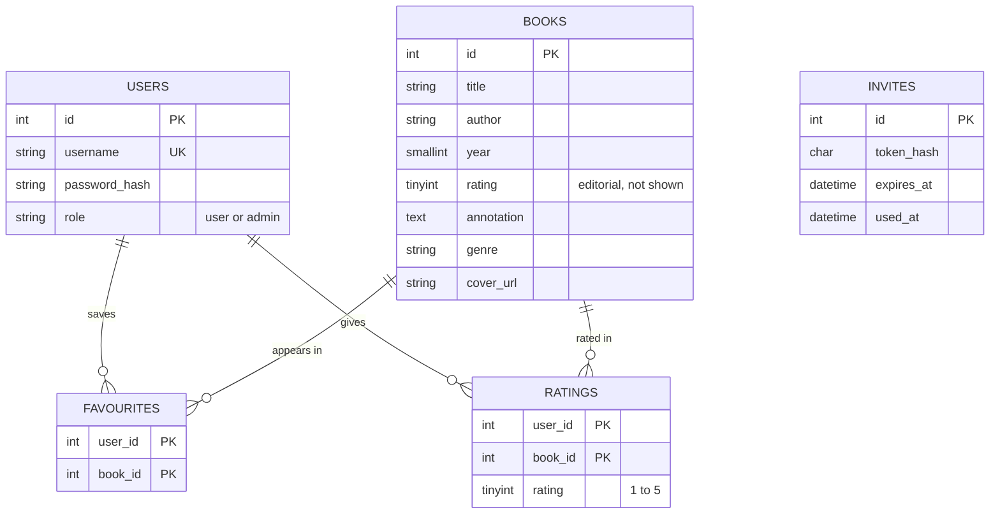
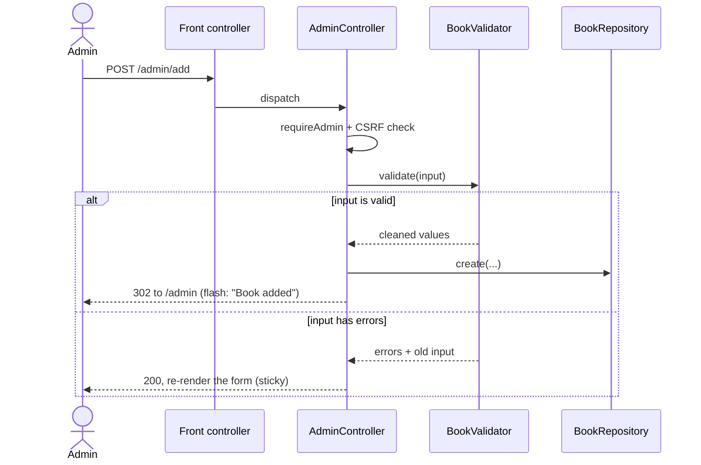

# Architecture and design notes

How the book catalogue is put together and why it is built the way it is. The
[README](../README.md) covers what it does and how to run it; this document is
for someone who will read or extend the code.

## The problem

The brief is a book register with a public side and an admin side. That maps to
three kinds of visitor, and the whole design follows from keeping their needs
apart:

- **A visitor** browses the catalogue, opens a book for its details, and prints
  the list. No account, no friction — this is the common case, so it is the
  fastest path and needs nothing from the server but a page.
- **A reader** (signed in) keeps a shelf of favourites and gives books their own
  1–5 rating. These are per-user writes, so they need a login and a CSRF token.
- **An admin** manages the catalogue: add, edit and delete books, import a JSON
  file, and invite another admin. Every action here is guarded and audited by a
  one-time token where it matters.

The assignment is graded on clarity, usability and how easily it runs, so the
guiding rule throughout is *do the simple thing well* rather than reach for
machinery the size of the problem does not justify.

## Domain model

Five tables. `books` is the only one with editorial content; the rest record
what users do with books.

Two things are worth calling out:

**The rating a visitor sees is the community average, not the editorial one.**
`books.rating` exists and is written by the admin form, but every listing and the
detail page instead compute `ROUND(AVG(ratings.rating))` over the readers' own
ratings (`BookRepository::all` / `find`). The editorial column is kept as a
fallback the schema could surface later, but the honest number to show a reader
is what other readers gave — so that is what is shown.

**There are no database foreign keys; the cascade lives in the application.**
`favourites` and `ratings` reference books by plain id, and `BookRepository::delete`
removes the child rows itself before deleting the book. This keeps the schema and
the SQL obvious to read at the cost of one deliberate cleanup step — an acceptable
trade for a catalogue this size, and a line in `delete()` documents it.

## Architecture

Plain PHP, no framework. Apache serves `public/` and rewrites every request that
is not a real file to the front controller, which maps the path to a controller
action.

The layers are thin and each has one job. The **front controller** (`public/index.php`)
loads the classes, starts the session and builds the route table. The **router**
(`src/Router.php`) is a lookup table from path to handler — no regex, no
middleware. Each **controller** (`src/Controllers/`) checks the guard and the CSRF
token, filters input, calls a validator and a repository, then either redirects
or renders a view. **Repositories** (`src/*Repository.php`) are the only place
with SQL, one per table. **Views** (`views/`) receive plain variables and only
present them. `OpenLibrary` is a side call made from a single admin route.

This started life as one large `switch` in the front controller. Splitting it
into a route table and four controllers cost nothing in machinery and made each
page findable on its own — the front controller now reads as a table of contents.

## A write, end to end

Every state-changing request follows the same shape. Adding a book shows all of
it: the admin guard, the CSRF check, shared validation, and Post/Redirect/Get so
a refresh never re-submits.

The same `BookValidator` runs for the add form, the edit form and the JSON
import, so the rules can never drift between the three. Messages between a write
and the page it redirects to are passed through a one-shot session flash that is
read and cleared on the next request.

## Routes

| Path | Method | Who | Does |
|---|---|---|---|
| `/` | GET | anyone | catalogue, or a book's detail with `?id=` |
| `/login` `/signup` `/logout` | GET/POST | anyone | sign in, register, sign out |
| `/favourites` | GET | reader | the user's saved books |
| `/favourite` | POST | reader | toggle a favourite |
| `/rate` | POST | reader | set a 1–5 rating |
| `/admin` | GET | admin | dashboard + manage-books table |
| `/admin/add` `/admin/edit` `/admin/delete` | GET/POST | admin | book CRUD |
| `/admin/import` | POST | admin | import a JSON file (deduped) |
| `/admin/book-lookup` | GET | admin | JSON metadata for the form (Open Library) |
| `/admin/invite` | POST | admin | mint a one-time admin invite |
| `/admin/accept` | GET/POST | invitee | set up an account from an invite |

Every state-changing `POST` carries a CSRF token; `/login` is the one exception
(its form has no session yet). The reader and admin routes are guarded by
`Auth::requireLogin` / `requireAdmin`.

## Interface

The look is deliberately editorial — a display face (Anton) over Inter, a warm
paper ground and a single electric-blue accent — so the catalogue reads like a
collection rather than a form. Covers are the clearest example of the "simple
thing done well" rule: when a book has a real cover it is shown, and when it does
not, a typographic cover is generated from the title's hash so the grid never has
a blank tile and never depends on the network to look finished.

The page adapts to the reader's theme, and everything below the covers is
progressive enhancement — search, the combined filters, the grid/list toggle and
the star-hover are JavaScript conveniences layered over a page that already works
without them.

| Book detail | Dark theme | Admin dashboard |
|---|---|---|
|  |  |  |

## Key decisions

**Plain PHP, no framework — on purpose.** For a handful of tables a framework
would add more to learn and hide the fundamentals (routing, PDO, sessions) the
task is meant to show. A route table and thin controllers are enough, and stay
readable end to end.

**MariaDB over SQLite or MySQL.** SQLite is simpler but wiring php-apache and a
database together in `docker-compose` is itself part of a full-stack task, so a
real database earns its place. MariaDB over MySQL because it is fully open-source
and common in local hosting; the two are interchangeable here (one line, the
image). SQLite stays a fallback if Docker misbehaves.

**Open Library, not Google Books, for the lookup.** Google Books needs an API
key — a secret to keep out of a public repo — and rate-limits without one.
Open Library needs neither, and when it is slow or offline the lookup simply
returns nothing and the form still works by hand.

**Demo credentials are committed — on purpose.** So the app can be tried the
moment it is up. A real deployment would seed the admin password randomly and
inject it as a secret; the README says so plainly.

**Security basics are not optional.** Prepared statements everywhere, output
escaped through one `e()` helper, passwords hashed with bcrypt, a CSRF token on
every write, a session cookie that is HttpOnly and SameSite with the id
regenerated on login, and invite tokens stored only as their sha256 hash.

## What I would do next

- Real foreign keys with `ON DELETE CASCADE`, behind a small migration runner, so
  the cleanup in `delete()` moves back into the database.
- Normalise authors and genres into their own tables once the catalogue is large
  enough to want author pages.
- A PHPUnit smoke suite over the validator and the repositories — the verification
  is currently manual (curl and a browser).
- Rate-limiting on `/login`, and server-side paging and search once the catalogue
  outgrows filtering the whole list in the browser.
