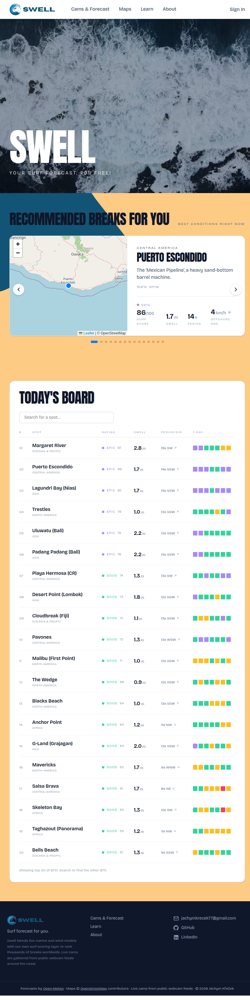
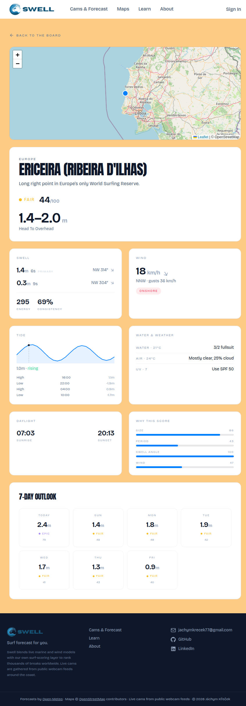
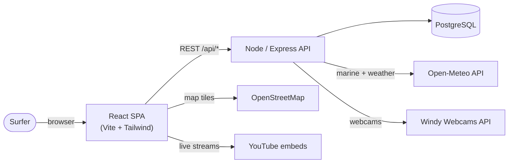

# 🌊 Swell

**A surf forecast that ranks the world's waves by how good they actually are right now — not just how big they are.**

Swell pulls live marine and weather data for a few thousand real surf breaks, runs each one through its own scoring model, and sorts the list so the spots that are firing float to the top. Click any spot for the full breakdown: swell trains, wind, tide, water temperature, and a 0–100 rating that explains itself.

🔗 **Live:** [radiant-nurturing-production-5f13.up.railway.app](https://radiant-nurturing-production-5f13.up.railway.app) · API at [portfolio-production-7b14.up.railway.app](https://portfolio-production-7b14.up.railway.app)



---

## What it does

Most forecast sites hand you a wall of numbers and leave you to judge them. Swell does the judging: a bigger wave isn't automatically a better wave, so instead of ranking by size it weighs swell, period, wind and the way each beach faces the ocean into a single score. A clean long-period groundswell in a light offshore breeze scores high; weak, windblown chop scores low.

It's a full-stack portfolio project — React on the front, a Node/Express API and PostgreSQL on the back, all data computed server-side and cached in the database.

## Features

- **Ranked board** — every spot scored 0–100 and sorted by current conditions, with a 7-day trend strip.
- **Rich spot pages** — swell trains, wind + gusts, an inline tide graph, water temp/wetsuit call, weather, sunlight, and a breakdown of *why* the score came out the way it did.
- **World map** — thousands of breaks clustered on an interactive Leaflet map, coloured by rating.
- **Live cams** — public YouTube surf streams matched to the nearest spot, plus Windy webcam timelapses.
- **Accounts** — register (with email verification), log in, favourite spots, and set a home region that biases your recommendations.
- **Learn** — a surf-etiquette primer and a short guide to reading a forecast.



## Tech stack

| Layer | Tools |
|---|---|
| **Frontend** | React 19, TypeScript, Vite, Tailwind CSS v4, React Router, TanStack Query, React-Leaflet |
| **Backend** | Node.js, Express, TypeScript, `pg`, bcrypt, JWT, Nodemailer |
| **Database** | PostgreSQL 16 |
| **Infra** | Docker (local Postgres), Railway (production) |
| **Data** | [Open-Meteo](https://open-meteo.com) marine + weather models, Windy Webcams, OpenStreetMap tiles |

## Architecture

The frontend is a single-page app that talks to the API over REST. The API is the only thing that touches the database or the outside data providers — all scoring happens there, and computed forecasts are cached per spot in Postgres.



For the component breakdown, request lifecycle and use cases, see **[docs/ARCHITECTURE.md](docs/ARCHITECTURE.md)**.

## The surf-scoring model

The model lives in [`surf-backend/surf-model.ts`](surf-backend/surf-model.ts) as a set of pure, deterministic functions — no machine learning, just physically-motivated heuristics. Each factor returns a 0–1 sub-score:

| Sub-score | What it measures |
|---|---|
| `size` | Rideable wave height — nothing under ~0.3 m, plateaus through the fun range, eases off when it's too big |
| `period` | The biggest quality signal — long-period groundswell over short wind-chop |
| `swellDir` | How squarely the swell hits the spot's facing (needs the break's orientation) |
| `wind` | Offshore grooms the wave, onshore wrecks it; scaled by speed and gusts |

They combine into the final score:

```
raw     = 0.5·size + 0.5·period          // the surf on offer
quality = swellDir · wind                // how well it's presented
score   = 100 · raw · (0.4 + 0.6·quality)
rating  = FLAT → POOR → FAIR → GOOD → EPIC
```

From the same data the model also derives the surf-height range (with a body-part label like *"chest to head"*), swell energy, a consistency estimate, the tide state, and the wetsuit/sunscreen calls.

## API

All responses are JSON. Endpoints marked 🔒 require a `Bearer` JWT.

| Method | Path | Purpose |
|---|---|---|
| `GET` | `/api/spots` | The full spot catalog |
| `GET` | `/api/forecast?latitude&longitude&orientation&id` | Enriched forecast for a spot (read-through DB cache) |
| `GET` | `/api/cams?lat&lon` | Live YouTube cams + Windy timelapses near a point |
| `GET` | `/api/cams/list` | The whole live-cam catalog |
| `POST` | `/api/auth/register` | Create an account, email a verification link |
| `POST` | `/api/auth/login` | Verify credentials, return a JWT |
| `GET` | `/api/auth/verify?token` | Confirm an email from the link |
| `GET` 🔒 | `/api/favorites` | The user's favourite spot ids |
| `POST` 🔒 | `/api/favorites/:spotId` | Add a favourite |
| `DELETE` 🔒 | `/api/favorites/:spotId` | Remove a favourite |
| `GET` 🔒 | `/api/profile` | Email + home region |
| `PUT` 🔒 | `/api/profile` | Update home region |

## Project structure

```
surfApp/
├── surf-backend/            # Node + Express + TypeScript API
│   ├── index.ts             # routes + server
│   ├── surf-model.ts        # the surf-scoring model (pure functions)
│   ├── auth.ts              # JWT middleware
│   ├── db.ts                # Postgres connection pool
│   ├── sql/                 # schema + migrations
│   ├── scripts/             # one-off data-import scripts
│   └── Dockerfile
├── surf-frontend/           # React + TypeScript + Vite SPA
│   └── src/
│       ├── pages/           # Home, SpotDetail, Cams, Maps, Learn, About
│       ├── components/      # UI building blocks
│       └── hooks/           # data hooks (React Query)
└── docs/                    # architecture + database documentation
```

## Running locally

You need Docker (for Postgres) and Node. Full notes are in [DEV.md](DEV.md); the short version:

```bash
# 1. Database — from surf-backend/
docker compose up -d db

# 2. Backend — from surf-backend/
cp .env.example .env         # fill in DB_* and a JWT_SECRET
npm install
npm run dev                  # http://localhost:3001

# 3. Frontend — from surf-frontend/
cp .env.example .env         # set VITE_API_URL=http://localhost:3001
npm install
npm run dev                  # http://localhost:5173
```

On first run, apply the schema and seed data from `surf-backend/sql/` (see [docs/DATABASE.md](docs/DATABASE.md) for the file order).

## Deployment

Production runs on Railway: the backend (Dockerfile), the frontend (Vite build), and a managed Postgres. The backend reads a single `DATABASE_URL` when present and falls back to the individual `DB_*` vars locally. Required environment variables:

- **Backend:** `DATABASE_URL`, `JWT_SECRET` (optional: `WINDY_WEBCAMS_KEY`, `SMTP_*`)
- **Frontend:** `VITE_API_URL` (optional: `VITE_WINDY_KEY`) — baked in at build time.

## Data & credits

- Marine and weather forecasts — [Open-Meteo](https://open-meteo.com) (free, open API)
- Map tiles — © [OpenStreetMap](https://www.openstreetmap.org/copyright) contributors
- Live cams — public YouTube streams; timelapses via the Windy Webcams API
- The spot catalog was seeded from public break listings; Swell stores coordinates and pointers, not third-party content.

Built by Jáchym Křeček.
