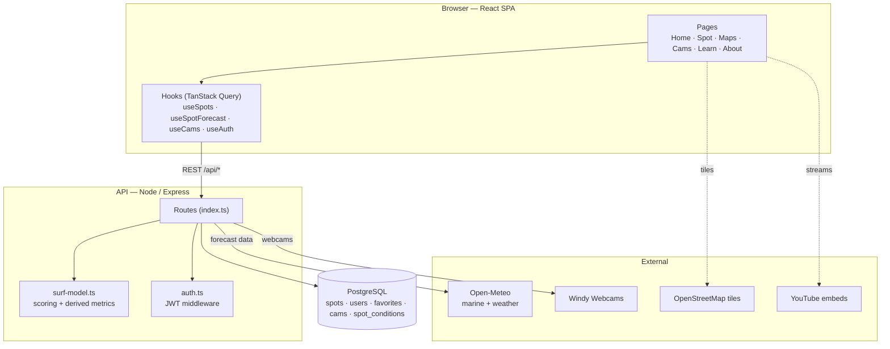
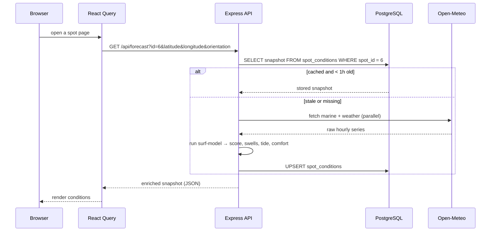
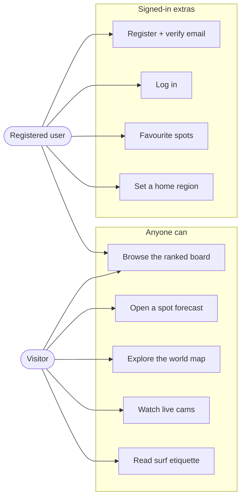

# Architecture

Swell is a classic three-tier app — a single-page frontend, a stateless REST API, and a PostgreSQL database — with a couple of external data providers behind the API. This document covers how the pieces fit together, how a request flows through them, and the design decisions worth knowing.

## Components

The frontend never talks to the database or the outside world directly; everything routes through the API, which is the only tier holding secrets and running the scoring model.

**Why this split?** Keeping all scoring on the server means the model is defined in exactly one place, the frontend stays a thin rendering layer, and API keys never reach the browser. React Query handles client-side caching and request de-duplication so opening the same spot twice costs nothing.

## Request lifecycle: a forecast

The forecast endpoint is a **read-through cache** over PostgreSQL. It serves a stored snapshot while it's fresh and only calls Open-Meteo when the data has gone stale, which keeps the app fast and well within the free API limits.

The homepage board reads the same endpoint per featured spot; the thousands of other breaks load their forecast lazily, only when their detail page opens.

## Caching strategy

Two things change at very different rates, so they're cached differently:

- **The spot catalog** rarely changes, so the frontend fetches it once and keeps it (React Query `staleTime: Infinity`). The full list also feeds the world map, so it lives in memory anyway — which is why spot search is done client-side with a debounce rather than a server round-trip.
- **Forecasts** change hourly, so each computed snapshot is stored in `spot_conditions` with a `fetched_at` timestamp and refreshed on read once it passes a one-hour TTL. Postgres is the cache; there's no Redis to operate.

Live-cam lookups have their own longer-lived in-memory cache since a beach's nearby webcams don't move.

## Use cases

A visitor gets the whole forecasting experience with no account. Registering only adds personalisation: saved favourites and a home region that biases the recommended-spots carousel toward where you actually surf.

## Data pipeline

Two datasets were assembled once, offline, and now live in the database — the app doesn't depend on those sources at runtime:

- **Spots** — a catalog of real ocean breaks (with coordinates and region), plus ~60 hand-curated marquee spots that carry descriptions, a `featured` flag and an approximate `orientation` (the compass bearing each break faces, which the model needs for offshore/onshore wind and swell angle).
- **Cams** — pointers to public YouTube live surf streams (video id + coordinates + a coarse continent), filtered down to genuinely coastal cameras. Swell stores the pointers, not the video.

At request time the API matches cams to a spot by great-circle (haversine) distance in SQL, so any spot can surface the nearest live camera without a per-spot lookup table.

## Security notes

- Passwords are hashed with bcrypt; the API never stores or returns a plaintext password.
- Login returns the same generic error for an unknown email and a wrong password, so the response can't be used to enumerate registered accounts.
- Auth is a stateless JWT (7-day expiry) checked by middleware on the protected routes.
- All API keys and the database URL are server-side environment variables; the browser only ever sees the public `VITE_*` config it's meant to.
