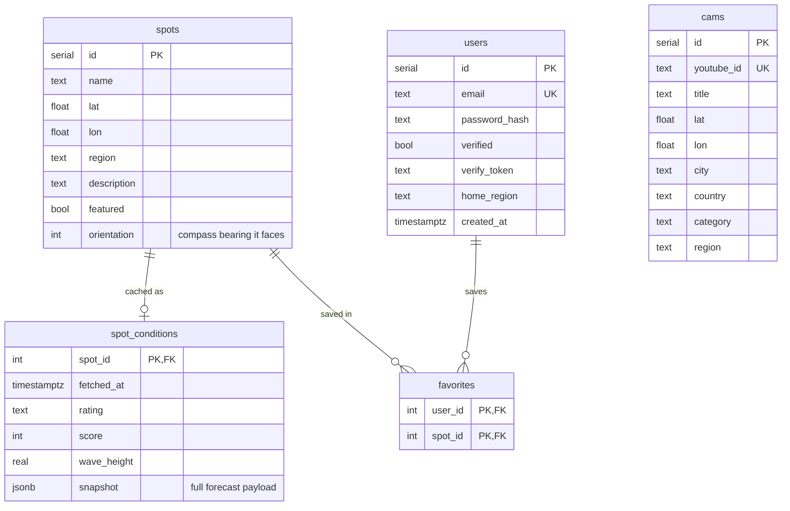

# Database

PostgreSQL 16. Five tables: the spot catalog and its cached conditions, live cams, and the user/favourites pair for accounts.

## Entity–relationship diagram

> `cams` has no foreign key to `spots` on purpose — a camera is matched to whatever spot is nearest at query time (haversine distance in SQL), so it isn't tied to one break.

## Tables

### `spots`
The catalog of surf breaks. `region` groups them for filtering; `featured` marks the hand-curated marquee spots shown on the homepage; `description` is the blurb on those spots' pages. `orientation` is the compass bearing the break faces out to sea — the model uses it to tell offshore wind from onshore and to judge swell angle. It's `NULL` for the long tail of imported spots, and the model degrades gracefully when it's missing.

### `spot_conditions`
A one-row-per-spot cache of the latest computed forecast. `snapshot` (JSONB) holds the full `/api/forecast` payload; `rating`, `score` and `wave_height` are denormalized out of it so the board can sort by conditions cheaply. `fetched_at` drives the one-hour read-through TTL. `ON DELETE CASCADE` from `spots`.

### `users`
Accounts. `password_hash` is bcrypt. `verified` + `verify_token` back the email-verification flow. `home_region` is the optional personalisation preference.

### `favorites`
The many-to-many join between `users` and `spots`. Composite primary key `(user_id, spot_id)`, both foreign keys `ON DELETE CASCADE`.

### `cams`
Pointers to public YouTube live surf streams — the `youtube_id`, coordinates, and a coarse continent (`region`) for filtering. Indexed on `(lat, lon)` and `region`.

## Migrations

The SQL lives in [`surf-backend/sql/`](../surf-backend/sql/). For a fresh database, apply them in this order:

| Order | File | Creates / changes |
|---|---|---|
| 1 | `schema.sql` | `spots` table + a starter seed |
| 2 | `users.sql` | `users` table |
| 3 | `favorites.sql` | `favorites` table |
| 4 | `profile.sql` | adds `users.home_region` |
| 5 | `verify.sql` | adds `users.verified` + `verify_token` |
| 6 | `spots-seed.sql` | upserts the curated spots + their columns |
| 7 | `world-spots.sql` | inserts the wider catalog (after the seed) |
| 8 | `orientation.sql` | sets `spots.orientation` bearings |
| 9 | `cams.sql` | `cams` table + data |
| 10 | `conditions.sql` | `spot_conditions` cache table |

The `CREATE TABLE`s use `IF NOT EXISTS`, the seeds use `ON CONFLICT DO NOTHING`, and the column adds use `ADD COLUMN IF NOT EXISTS` — so every file is idempotent and safe to re-run against an existing database.

Locally the schema is applied automatically: `schema.sql` is mounted into the Postgres container's `docker-entrypoint-initdb.d/`, so a fresh `docker compose up` bootstraps the `spots` table on first start.
